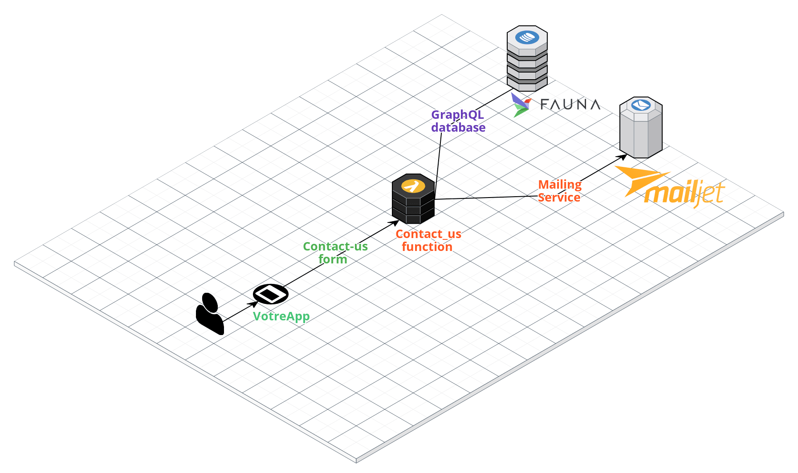

# 
VotreApp

### Run:

`npm install`

`npm run dev` _(Start HRM dev-server for lambda functions and front-end)_

**To serve the front-end only**

`npm run serve`

**To build the app run**

`npm run build`

### 
App architecture

